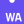

## Hi there, I'm Christian! 👋

I'm a software engineer and teacher working in Munich, Germany.

Previously I have been studying Computer Science, Mathematics and Educational Psychology while working at the university as a teaching assistant and later as a high school teacher before pursuing a career as a software engineer.

### Quick Facts

- 🔭 I'm working in the [WebStorm](https://www.jetbrains.com/webstorm/) product team at [JetBrains](https://www.jetbrains.com/).
- 🌱 One of my aspirations is to visit Australia as part of a work-and-travel experience.
- 👯 I'm looking to collaborate on open-source projects.
- 💬 Ask me anything about web development using any of the tools listed below.
- 📫 How to reach me: via the mail address linked on my profile page.
- ⚡ Fun fact: the 28th edition of the Duden introduced the word "nice" to the German language.

### Languages and Tools

In the past 20 years I have been learning various technologies, including different languages, frameworks and tools. Therefore I am very confident in picking up technology that is heretofore unknown to me and getting familiar with it in a short amount of time.

This is a list of programming languages, tools and services that I have been using **recently** at work and/or for personal side projects in my spare time:

<table>
  <tr>
    <td align="center">
      <picture>
        <source
          srcset="images/cypress-dark.svg"
          media="(prefers-color-scheme: dark)"
        />
        
      </picture>
       
      <b>Cypress</b>
    </td>
    <td align="center">
      <picture>
        <source
          srcset="images/docker-dark.svg"
          media="(prefers-color-scheme: dark)"
        />
        
      </picture>
       
      <b>Docker</b>
    </td>
    <td align="center">
      <picture>
        <source
          srcset="images/eslint-dark.svg"
          media="(prefers-color-scheme: dark)"
        />
        
      </picture>
       
      <b>ESLint</b>
    </td>
    <td align="center">
      <picture>
        <source
          srcset="images/headlessui-dark.svg"
          media="(prefers-color-scheme: dark)"
        />
        
      </picture>
       
      <b>Headless UI</b>
    </td>
    <td align="center">
      <picture>
        <source
          srcset="images/intellijidea-dark.svg"
          media="(prefers-color-scheme: dark)"
        />
        
      </picture>
       
      <b>IntelliJ</b>
    </td>
    <td align="center">
      <picture>
        <source
          srcset="images/jest-dark.svg"
          media="(prefers-color-scheme: dark)"
        />
        
      </picture>
       
      <b>Jest</b>
    </td>
    <td align="center">
      <picture>
        <source
          srcset="images/nestjs-dark.svg"
          media="(prefers-color-scheme: dark)"
        />
        
      </picture>
       
      <b>Nest.js</b>
    </td>
    <td align="center">
      <picture>
        <source
          srcset="images/nextdotjs-dark.svg"
          media="(prefers-color-scheme: dark)"
        />
        
      </picture>
       
      <b>Next.js</b>
    </td>
  </tr>
  <tr>
    <td align="center">
      <picture>
        <source
          srcset="images/nodedotjs-dark.svg"
          media="(prefers-color-scheme: dark)"
        />
        
      </picture>
       
      <b>Node.js</b>
    </td>
    <td align="center">
      <picture>
        <source
          srcset="images/npm-dark.svg"
          media="(prefers-color-scheme: dark)"
        />
        
      </picture>
       
      <b>NPM</b>
    </td>
    <td align="center">
      <picture>
        <source
          srcset="images/nx-dark.svg"
          media="(prefers-color-scheme: dark)"
        />
        
      </picture>
       
      <b>NX</b>
    </td>
    <td align="center">
      <picture>
        <source
          srcset="images/planetscale-dark.svg"
          media="(prefers-color-scheme: dark)"
        />
        
      </picture>
       
      <b>Planetscale</b>
    </td>
    <td align="center">
      <picture>
        <source
          srcset="images/playwright-dark.svg"
          media="(prefers-color-scheme: dark)"
        />
        
      </picture>
       
      <b>Playwright</b>
    </td>
    <td align="center">
      <picture>
        <source
          srcset="images/prettier-dark.svg"
          media="(prefers-color-scheme: dark)"
        />
        
      </picture>
       
      <b>Prettier</b>
    </td>
    <td align="center">
      <picture>
        <source
          srcset="images/prisma-dark.svg"
          media="(prefers-color-scheme: dark)"
        />
        
      </picture>
       
      <b>Prisma</b>
    </td>
    <td align="center">
      <picture>
        <source
          srcset="images/railway-dark.svg"
          media="(prefers-color-scheme: dark)"
        />
        
      </picture>
       
      <b>Railway</b>
    </td>
  </tr>
  <tr>
    <td align="center">
      <picture>
        <source
          srcset="images/react-dark.svg"
          media="(prefers-color-scheme: dark)"
        />
        
      </picture>
       
      <b>React</b>
    </td>
    <td align="center">
      <picture>
        <source
          srcset="images/redis-dark.svg"
          media="(prefers-color-scheme: dark)"
        />
        
      </picture>
       
      <b>Redis</b>
    </td>
    <td align="center">
      <picture>
        <source
          srcset="images/redux-dark.svg"
          media="(prefers-color-scheme: dark)"
        />
        
      </picture>
       
      <b>Redux</b>
    </td>
    <td align="center">
      <picture>
        <source
          srcset="images/rust-dark.svg"
          media="(prefers-color-scheme: dark)"
        />
        
      </picture>
       
      <b>Rust</b>
    </td>
    <td align="center">
      <picture>
        <source
          srcset="images/spring-dark.svg"
          media="(prefers-color-scheme: dark)"
        />
        
      </picture>
       
      <b>Spring</b>
    </td>
    <td align="center">
      <picture>
        <source
          srcset="images/springboot-dark.svg"
          media="(prefers-color-scheme: dark)"
        />
        
      </picture>
       
      <b>Spring Boot</b>
    </td>
    <td align="center">
      <picture>
        <source
          srcset="images/storybook-dark.svg"
          media="(prefers-color-scheme: dark)"
        />
        
      </picture>
       
      <b>Storybook</b>
    </td>
    <td align="center">
      <picture>
        <source
          srcset="images/tailwindcss-dark.svg"
          media="(prefers-color-scheme: dark)"
        />
        
      </picture>
       
      <b>Tailwind CSS</b>
    </td>
  </tr>
  <tr>
    <td align="center">
      <picture>
        <source
          srcset="images/trpc-dark.svg"
          media="(prefers-color-scheme: dark)"
        />
        
      </picture>
       
      <b>tRPC</b>
    </td>
    <td align="center">
      <picture>
        <source
          srcset="images/turborepo-dark.svg"
          media="(prefers-color-scheme: dark)"
        />
        
      </picture>
       
      <b>Turborepo</b>
    </td>
    <td align="center">
      <picture>
        <source
          srcset="images/typescript-dark.svg"
          media="(prefers-color-scheme: dark)"
        />
        
      </picture>
       
      <b>TypeScript</b>
    </td>
    <td align="center">
      <picture>
        <source
          srcset="images/vercel-dark.svg"
          media="(prefers-color-scheme: dark)"
        />
        
      </picture>
       
      <b>Vercel</b>
    </td>
    <td align="center">
      <picture>
        <source
          srcset="images/visualstudiocode-dark.svg"
          media="(prefers-color-scheme: dark)"
        />
        
      </picture>
       
      <b>VS Code</b>
    </td>
    <td align="center">
      <picture>
        <source
          srcset="images/webassembly-dark.svg"
          media="(prefers-color-scheme: dark)"
        />
        
      </picture>
       
      <b>WebAssembly</b>
    </td>
  </tr>
</table>
